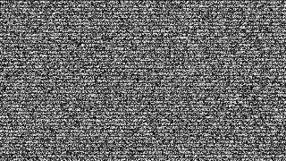
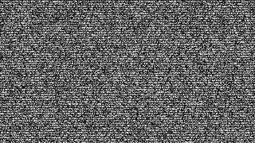

# tv-static-gif

Biblioteca Python e ferramenta de terminal para criar animações de chiado de TV. Ela gera GIF, WebP animado ou APNG com fundo, texto e logo/imagem em chiado independente.

Por padrão, a animação tem 5 segundos, 820×740 px e 24 fps.

## Instalação

Quando o pacote estiver publicado:

```bash
pip install tv-static-gif
```

Para desenvolver neste repositório:

```bash
python -m pip install -e ".[dev]"
```

Verifique a instalação:

```bash
tv-static-gif --version
tv-static-gif --help
```

## Início rápido

Crie um GIF simples:

```bash
tv-static-gif tv.gif
```

Crie um GIF com texto. O fundo troca a 24 fps e o chiado dentro das letras troca a 6 fps:

```bash
tv-static-gif tv.gif --text "TV" --font-size 280 --background-fps 24 --text-fps 6
```

O mesmo exemplo em Python:

```python
from tv_static_gif import generate_tv_static

generate_tv_static(
    "tv.gif",
    text="TV",
    font_size=280,
    background_fps=24,
    text_fps=6,
)
```

## Conceitos principais

`fps` é a taxa de reprodução do arquivo. `background_fps`, `text_fps` e `image_fps` controlam com que frequência cada chiado é trocado e devem ser menores ou iguais a `fps`.

Texto e imagens não recebem uma cor sólida: eles usam o mesmo chiado cinza de pixels 1×1 do fundo, só com uma velocidade independente. Isso permite que as letras apareçam pelo movimento diferente da estática.

## Exemplos visuais

### CRT com texto lento

Fundo a 12 fps e texto a 3 fps, com linhas de varredura do preset `crt`.



### Sinal fraco com marca

O preset `weak-signal` combina tremor, cintilação e interferência. A marca no canto inferior usa uma máscara PNG e seu próprio ritmo de chiado.



## Linha de comando

Formato geral:

```bash
tv-static-gif SAIDA [opções]
```

### Todos os parâmetros

| Opção                        | Padrão                | Descrição                                                      |
| ------------------------------ | ---------------------- | ---------------------------------------------------------------- |
| `output`                     | obrigatório           | Caminho do arquivo de saída.                                    |
| `--version`                  | —                     | Mostra a versão instalada.                                      |
| `--width N`                  | `820`                | Largura original em pixels.                                      |
| `--height N`                 | `740`                | Altura original em pixels.                                       |
| `--duration N`               | `5`                  | Duração em segundos.                                           |
| `--fps N`                    | `24`                 | FPS de reprodução; de 1 a 100.                                 |
| `--background-fps N`         | igual a`--fps`       | Velocidade de troca do fundo.                                    |
| `--text TEXTO`               | —                     | Texto renderizado como chiado.                                   |
| `--text-fps N`               | `6`                  | Velocidade de troca do chiado no texto.                          |
| `--font ARQUIVO`             | fonte do sistema       | Fonte`.ttf` ou `.otf`.                                       |
| `--font-size N`              | `220`                | Tamanho da fonte em pixels.                                      |
| `--text-position POSIÇÃO`  | `center`             | `top`, `center` ou `bottom`.                               |
| `--no-auto-fit`              | desligado              | Não reduz a fonte automaticamente quando o texto não cabe.     |
| `--image ARQUIVO`            | —                     | PNG/imagem com transparência usada como máscara de chiado.     |
| `--image-fps N`              | igual a`--text-fps`  | Velocidade do chiado da imagem.                                  |
| `--image-position POSIÇÃO` | `bottom`             | `top`, `center` ou `bottom`.                               |
| `--image-scale N`            | `0.25`               | Fração máxima do quadro usada pela imagem.                    |
| `--preset NOME`              | `crt`                | `clean`, `crt`, `weak-signal` ou `vhs`.                  |
| `--quality NÍVEL`           | `high`               | `low`, `medium` ou `high`. Define escala e cores.          |
| `--scale N`                  | definido por qualidade | Escala final do quadro;`0.5` produz metade da largura/altura.  |
| `--colors N`                 | definido por qualidade | Número de tons de cinza, de 2 a 256.                            |
| `--format FORMATO`           | pela extensão         | `gif`, `webp` ou `apng`.                                   |
| `--loop N`                   | `0`                  | Repetições;`0` significa repetir infinitamente.              |
| `--output-dir PASTA`         | —                     | Pasta de destino; preserva apenas o nome informado em`output`. |
| `--seed N`                   | aleatória             | Semente para reproduzir a mesma animação.                      |
| `--preview`                  | desligado              | Abre o arquivo quando a geração termina.                       |

### Exemplos de terminal

GIF de 10 segundos em resolução personalizada:

```bash
tv-static-gif chiado.gif --width 1280 --height 720 --duration 10 --fps 30
```

Fundo veloz e texto lento:

```bash
tv-static-gif tv.gif --text "SEM SINAL" --fps 24 --background-fps 24 --text-fps 4
```

Texto embaixo, com fonte escolhida:

```powershell
tv-static-gif tv.gif --text "AO VIVO" --font "C:/Windows/Fonts/arialbd.ttf" --font-size 150 --text-position bottom
```

Logo PNG no topo, com velocidade separada:

```bash
tv-static-gif tv.gif --image logo.png --image-position top --image-scale 0.2 --image-fps 8
```

Efeito de sinal fraco:

```bash
tv-static-gif sinal.gif --preset weak-signal --text "SEM SINAL" --text-fps 3
```

Efeito VHS e arquivo menor:

```bash
tv-static-gif fita.webp --format webp --preset vhs --quality medium --text "VHS"
```

APNG com poucos tons de cinza:

```bash
tv-static-gif chiado.png --format apng --quality low --colors 32
```

Metade da resolução, com duas repetições:

```bash
tv-static-gif pequeno.gif --scale 0.5 --loop 2
```

Salvar numa pasta e abrir após gerar:

```bash
tv-static-gif tv.gif --output-dir ./gifs --preview
```

Gerar a mesma animação novamente:

```bash
tv-static-gif teste.gif --seed 42 --text "TESTE"
```

## API Python

Há duas funções públicas:

```python
from tv_static_gif import generate_tv_static, generate_tv_static_gif
```

- `generate_tv_static(...)`: cria GIF, WebP ou APNG.
- `generate_tv_static_gif(...)`: compatível com versões antigas; sempre cria GIF.

### Assinatura completa

```python
generate_tv_static(
    output,
    width=820, height=740, duration=5, fps=24,
    background_fps=None,
    text=None, text_fps=6, font_path=None, font_size=220,
    text_position="center", auto_fit=True,
    image_path=None, image_fps=None, image_position="bottom", image_scale=0.25,
    preset="crt", quality="high", scale=None, colors=None,
    output_format=None, loop=0, seed=None, progress=None,
)
```

| Parâmetro                                      | Descrição                                                                 |
| ----------------------------------------------- | --------------------------------------------------------------------------- |
| `output`                                      | Caminho do arquivo criado. A extensão pode definir o formato.              |
| `width`, `height`, `duration`, `fps`    | Dimensões, duração e taxa de reprodução.                               |
| `background_fps`, `text_fps`, `image_fps` | Velocidade de atualização do chiado em cada camada.                       |
| `text`, `font_path`, `font_size`          | Conteúdo e estilo do texto.                                                |
| `text_position`, `image_position`           | `top`, `center` ou `bottom`.                                          |
| `auto_fit`                                    | Ajusta o texto horizontalmente para caber no quadro.                        |
| `image_path`, `image_scale`                 | Imagem usada como máscara e seu tamanho máximo proporcional.              |
| `preset`                                      | `clean`, `crt`, `weak-signal` ou `vhs`.                             |
| `quality`                                     | `low` = 50%/64 tons; `medium` = 75%/128 tons; `high` = 100%/256 tons. |
| `scale`, `colors`                           | Sobrescrevem a escala e os tons definidos pela qualidade.                   |
| `output_format`                               | `gif`, `webp` ou `apng`; quando `None`, usa a extensão.            |
| `loop`                                        | Número de repetições;`0` é infinito.                                  |
| `seed`                                        | Inteiro para resultado reproduzível.                                       |
| `progress`                                    | Função opcional chamada como`progress(quadro_atual, total_de_quadros)`. |

### Exemplos em Python

GIF simples:

```python
from tv_static_gif import generate_tv_static_gif

path = generate_tv_static_gif("chiado.gif")
print(path)
```

WebP com todas as camadas:

```python
from tv_static_gif import generate_tv_static

generate_tv_static(
    "sinal.webp",
    output_format="webp",
    preset="vhs",
    quality="medium",
    text="AO VIVO",
    text_position="top",
    text_fps=5,
    background_fps=24,
    image_path="logo.png",
    image_position="bottom",
    image_fps=8,
)
```

Usando progresso:

```python
from tv_static_gif import generate_tv_static

def progresso(atual, total):
    print(f"Quadro {atual}/{total}")

generate_tv_static("progresso.gif", text="TV", progress=progresso)
```

## Presets

- `clean`: apenas ruído cinza, sem efeitos extras.
- `crt`: linhas de varredura, pequena oscilação e cintilação leve.
- `weak-signal`: cintilação, tremor e faixas de interferência mais fortes.
- `vhs`: efeito de fita com linhas, tremor e glitches horizontais.

## Tamanho de arquivo e desempenho

Ruído aleatório comprime pouco. GIFs de 820×740 px, 24 fps e 5 segundos podem ser grandes. Para reduzir o arquivo, prefira `--quality medium`, `--quality low`, `--scale 0.5`, menos duração ou WebP animado.

## Desenvolvimento, testes e PyPI

```bash
python -m pip install -e ".[dev]"
python -m pytest -q
python -m build
twine check dist/*
```

O workflow em `.github/workflows/tests.yml` executa testes e build no GitHub Actions. Antes de publicar, troque o autor e as URLs em `pyproject.toml`, reserve o nome no PyPI e use:

```bash
twine upload dist/*
```

## Licença

MIT. Veja [LICENSE](LICENSE).
